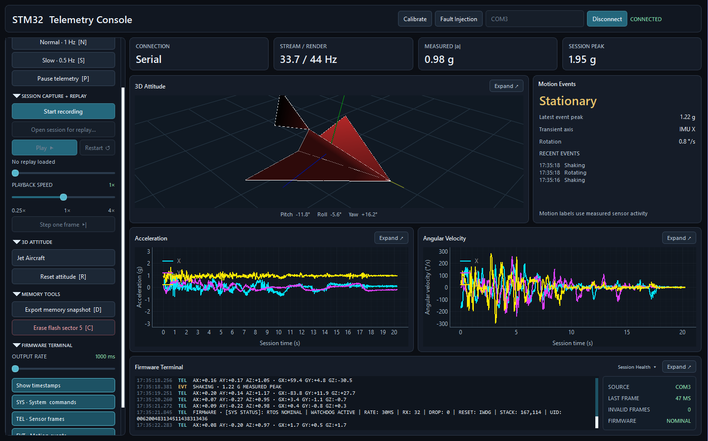
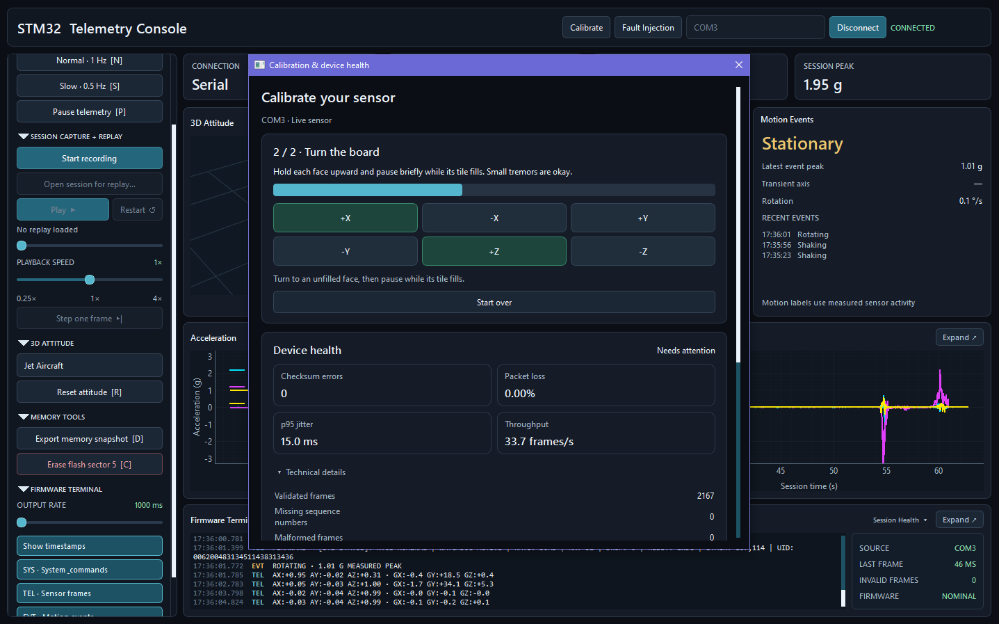
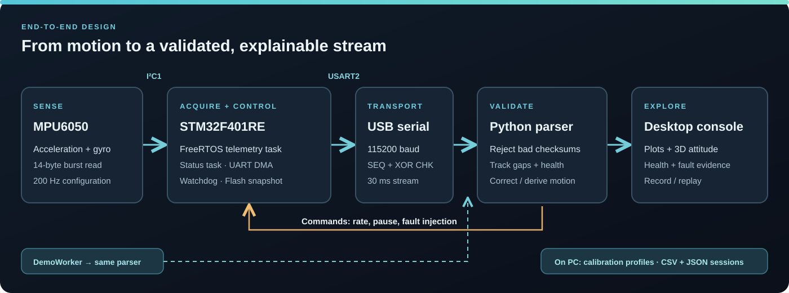
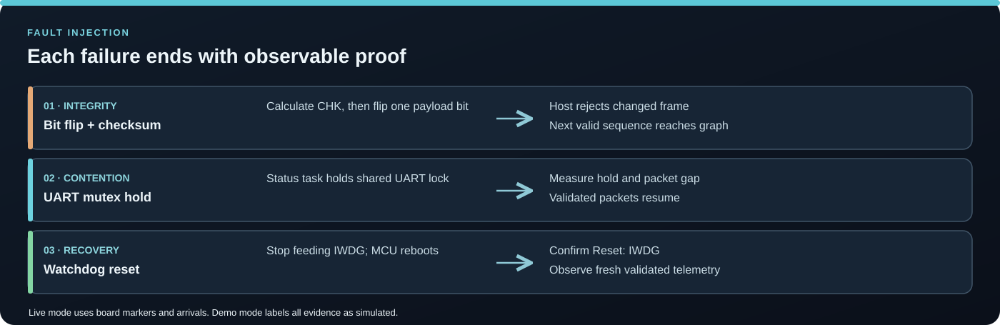
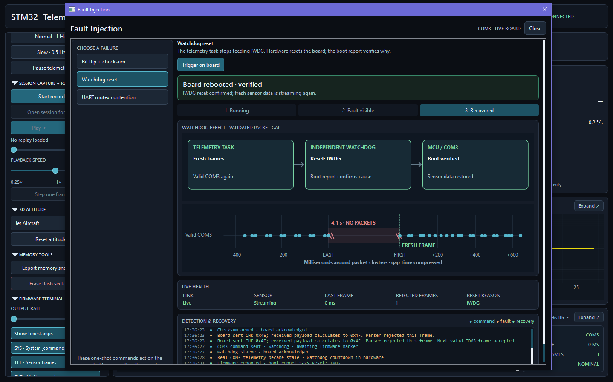

# STM32 Telemetry Console

An end-to-end motion telemetry project for the **Nucleo STM32F401RE** and **MPU6050**. FreeRTOS firmware streams checksummed sensor data to a Python console for plots, 3D attitude, recording, and fault diagnosis. **Demo mode runs without hardware.**



*Live COM3 telemetry during board movement: 30-second plots, 3D attitude, and motion events.*

## Try the demo

On Windows with Python 3.10 or newer:

```powershell
py -m venv .venv
.\.venv\Scripts\Activate.ps1
python -m pip install -r requirements.txt
python app.py
```

Select **DEMO — No Hardware → Connect**. Open **Fault Injection** and run **Bit flip + checksum** to see a bad packet rejected and the next valid one accepted. UART contention and watchdog recovery are also available. Simulated evidence is labeled **Demo**.

## Connect a real board

You need a Nucleo STM32F401RE, an MPU6050 breakout, jumper wires, and a USB connection for ST-LINK. The firmware expects I²C address **0x68** (`AD0` low). Check your breakout's voltage requirements before wiring:

| MPU6050 | STM32F401RE |
| --- | --- |
| SDA | PB9 / I²C1 SDA |
| SCL | PB8 / I²C1 SCL |
| GND | GND |
| VCC | 3.3 V, if supported by the breakout |
| AD0 | GND for address 0x68 |

Open [`firmware/MPU6050_FreeRTOS.ioc`](firmware/MPU6050_FreeRTOS.ioc) in STM32CubeIDE, build, and flash through ST-LINK. Connect the board's USB serial port, run `python app.py`, select its **COM** port, and click **Connect**. The app requests a 30 ms stream interval. See [firmware build notes](firmware/README.md).

## Explore the console

| Workflow | In the app |
| --- | --- |
| Live motion | 30-second plots, motion events, connection health, and a 3D aircraft. |
| Capture and replay | **Start recording → Stop & save recording** writes CSV plus JSON. Use **Open session for replay…** to seek, step, and change speed. |
| Calibrate | With live data and recording stopped, open **Calibrate → Start calibration** for gyro and six-face checks; save a PC profile. |
| Diagnose | Open **Calibrate** for link and firmware health. Open **Fault Injection** for one-shot faults. |



*Live calibration and health: two faces completed; 2,167 validated frames, 0 checksum errors, and 0 missing sequence numbers. “Needs attention” reflects the board's previous IWDG reset.*

## System design



- **Firmware:** synchronized 14-byte I²C reads, FreeRTOS telemetry and status tasks, DMA UART, watchdog, and Flash crash snapshot.
- **Protocol:** sequence numbers and an 8-bit XOR checksum let the host reject bad frames and measure gaps.
- **Desktop:** serial, demo, and replay sources feed the same console. PC calibration and validated recordings keep replay consistent.



On hardware, the three faults corrupt one frame, hold the UART lock, or stop IWDG refresh. The app waits for packet, timing, or boot evidence before reporting success. Demo mode runs labeled simulations through the host parser.



*Live watchdog demonstration: the board reports `Reset: IWDG`, then fresh validated telemetry resumes after a measured 4.1 s packet gap.*

## Verify and navigate

```powershell
python -m unittest discover -s tests -v
python tests/smoke_dashboard.py
```

The first command runs hardware-free tests; the second needs a desktop/OpenGL context. Connected-board checks are in `tests/live_*_smoke.py`.

Code map: [`firmware/`](firmware/) handles acquisition; [`app.py`](app.py), [`sources.py`](sources.py), and [`fault_ui.py`](fault_ui.py) handle the console and sources; [`telemetry.py`](telemetry.py), [`kinematics.py`](kinematics.py), and [`motion_events.py`](motion_events.py) process data; [`session_io.py`](session_io.py) and [`calibration.py`](calibration.py) manage saved state.

Shortcuts: **V/F/N/S** change stream rate, **P** pauses, **R** zeros orientation, **D** dumps the Flash snapshot, **C** erases and re-arms the crash log, and **Esc** closes an expanded view.

Motion labels are demonstration heuristics, not safety measurements. The MPU6050 cannot provide drift-free position or absolute yaw. MIT licensed; see [LICENSE](LICENSE).
